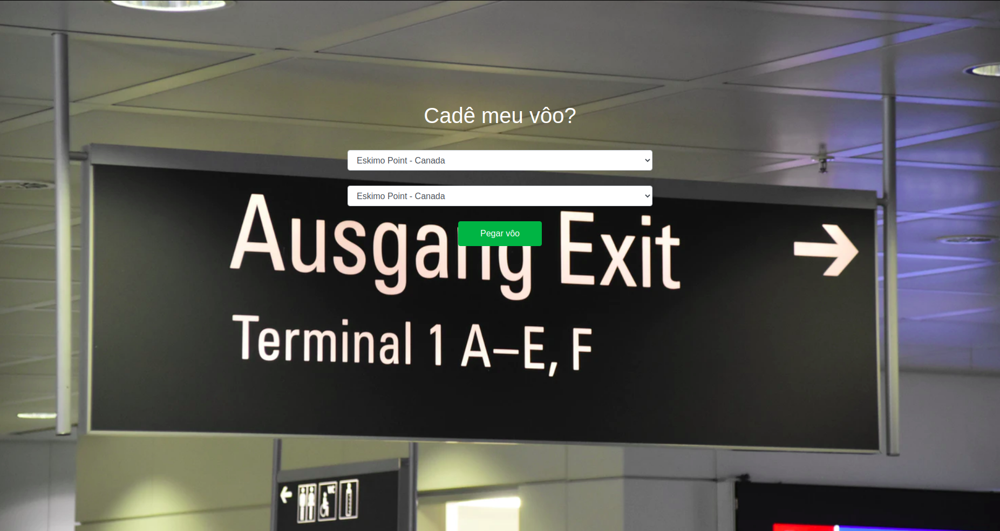
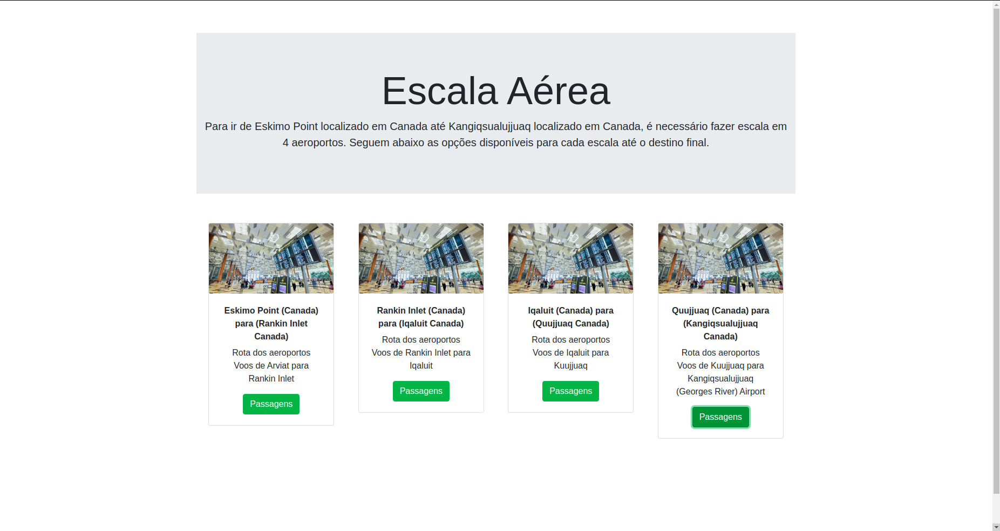
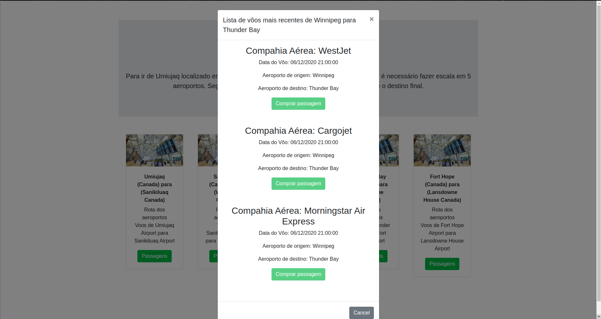

**Número da Lista**: Trabalho Final 
**Dupla 5A** 
**Conteúdo da Disciplina**: Dijkstra e Dividir para conquistar 

## Alunos
|Matrícula | Aluno |
| -- | -- |
| 17/0138551|Bruno Duarte|
| 17/0033112|Eugênio Sales|

## Sobre
- O "Cadê meu vôo?" é uma aplicação web, cujo objetivo é fornecer o itinerário e as passagens de cada vôo do itinerário com base na cidade de origem até a cidade de destino.
- A utilizaçã do Dijkstra no grafo de aeroportos deve-se ao fato que nem toda cidade de origem e destino possuem conexão direta e para o contornar o problema, é preciso saber qual a escala de aeroportos fornece a menor distância percorrida baseada em latitude e longitude dos aeroportos de cada cidade.
- Além disso, uma vez descoberto o melhor itinerário de aeroportos, o "Cadê meu Vôo" fornece dados de cada vôo da escala a partir de uma API que tem controle de vôos reais, a AviationStack
- E para exibição dos vôos em ordem da data e horário mais próxima para a mais distante é utilizado o Merge Sort, baseado no módulo de Dividir e Conquistar 

## Screenshots

## Depêndecnias

**Linguagem**: Javascript (Framework React.js)
 

## Execução

- É necessário instalação do [Npm](https://docs.npmjs.com/cli/install) e [Node](https://nodejs.org/en/download/)
- Clone o repositório
- Instale as depências `$ npm install`
- Inicie `$ npm start`

## Uso 
A utilização do projeto requer poucos passos visando facilitar a correção do projeto. Após instalar as duas depêndencias

> 1 - Escolha 2 aeroports diferentes no Drop Down

> 2 - Seguem os cards com opções de vôos para cada um dos caminhos indicados pelo grafo. Cada Card é correspondente a um caminho entre 2 nós do grafo, ou seja, o trajeto de uma aeroporto ao outro dentro da escala.

> 3 - Ao conferir os vôos, é demonstrado uma lista de vôos para o loca selecionado incluindo informações como data e compahia aérea a partri de uma api em tempo real

## Outros 
O foco do projeto foi demonstrar a melhor escala aérea possível considerando-se latitude e longitude dos aeroportos como pesos das arestas. E uma, vez demonstradas as escalas os possǘeis vôoes em tempo real desse caminho sugerid.
